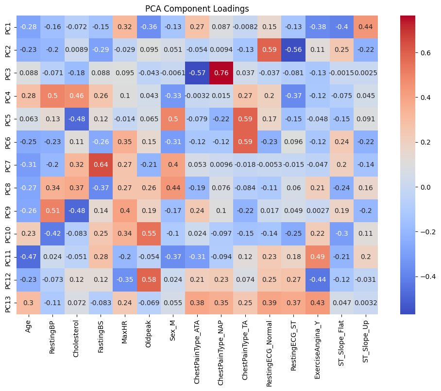

## CS4641_Group5
Patcharapong Aphiwetsa, SeungTaek(Stan) Lee, Shayahn Mirfendereski, Sunho(Sunny) Park, Joshua K Thomas

## Introduction/Background
According to the CDC [1], heart failure is the leading cause of death in the world, affecting over 600,000 people in the U.S. alone. There are more than a handful of machine learning models [2], [3], such as K Nearest Neighbor, Naive Bayes Classifier, and Ridge Classifier, that have been applied to predict heart failure by utilizing inputted clinical features. These features can include age, cholesterol levels, and blood pressure. The provided datasets contain comprehensive statistics of clinical factors relating to the risk of heart failure:
1. **[Heart Failure Prediction Dataset](https://www.kaggle.com/datasets/fedesoriano/heart-failure-prediction) by fedesoriano:**
   - Features: Common event features caused by CVDs
2. **[Heart Failure Clinical Records](https://www.kaggle.com/datasets/nimapourmoradi/heart-failure-clinical-records) by Nima Pourmoradi:**
   - Features: Clinical records specific to heart failure
3. **[Indicators of Heart Disease](https://www.kaggle.com/datasets/kamilpytlak/personal-key-indicators-of-heart-disease) by KAMIL PYTLAK:**
   - Features: Data collected from CDC, including all the major risk factors for heart failure
 
 

## Problem/Motivation
Despite significant advances in medical technology, accurately predicting heart failure remains a challenging task. Many existing models are not generalizable across different patient populations and often fail to provide actionable insights for healthcare providers. The complexity and variability of human physiology necessitate more sophisticated predictive models that can handle diverse and high-dimensional data. For instance, several research papers like [4] have identified various factors, including environmental, genetic, and lifestyle factors, that are correlated with heart failure risk, underscoring the need for improved predictive models that effectively capture and embody the relationships among them. Such models are crucial for identifying high-risk patients earlier and more accurately in a wider range of scope, enhancing treatment plans and reducing mortality rates. Leveraging machine learning models can provide robust, reliable predictions in clinical settings.
 

## Data Cleaning
Our group decided to utilize the first dataset we found from Kaggle, the _Heart Failure Prediction Dataset_. The dataset contained some missing values and inconsistencies that needed to be addressed before we could proceed with our analysis. Here, we describe the steps we took to clean the dataset and provide a comparison of the dataset before and after cleaning.
 

**Cleaning Proces: Handling Missing Values**:
   - We identified that the dataset had several missing values, particularly in the `RestingBP` and `Cholesterol` columns. These missing values were addressed by removing rows with zero values in these columns to ensure the accuracy and integrity of our data.
 

**Cleaning Code**

- We attempted using K-Means, but had lower accuracy, so we are planning on improving the code for the next step.

**Before Cleaning**

**After Cleaning**

As illustrated, the data cleaning process significantly improved the dataset quality, making it more suitable for subsequent analysis and modeling.
 

## Methods
1. **Supervised Methods:**
   - **Random Forest Classification (sklearn)** for highlighting important features and complex relationships.
   - **K-Nearest Neighbors (scikit-learn)** for simple predictions based on similarity and visualization of the data.
   - **Neural Network (pytorch)** for handling high-dimensional data with deep learning techniques for flexibility.
2. **Data Preprocessing:**
   - **Dimensionality Reduction with PCA** to simplify data and remove redundant features.
   - **Fill in missing data (pandas)**
 
 

## 1st Supervised Method: Random Forest Model ##

1. **Loading the Dataset:** We loaded the cleaned dataset and checked the data types to ensure proper conversion of string data to appropriate types.

2. **Handling Categorical Variables:** We used label encoding for categorical variables, as it is suitable for tree-based algorithms like Random Forest.

3. **Scaling Features:** Numerical features were scaled to standardize the data, which helps in improving model performance and stability.

 

**Model Training and Evaluation**

We used Stratified K-Fold cross-validation to estimate the performance of our model. 

**Stratified k-fold cross-validation :**
- For skewed datasets, such as those with 90% positive and 10% negative samples, using simple k-fold cross-validation can result in folds with only negative samples.
- In such cases, stratified k-fold cross-validation is preferred. This method ensures that the ratio of labels (e.g., 90% positive and 10% negative) remains consistent in each fold.
- By maintaining this ratio, stratified k-fold cross-validation provides more reliable and consistent evaluation metrics across all folds, regardless of the metric chosen.
 

   **OUTPUT**
  
   Cross-Validation ROC-AUC Scores: [0.93936966 0.93418202 0.92759119 0.93625858 0.90790899]
  
   Mean ROC-AUC Score: 0.929062086192368

  Considering that ROC-AUC Score is approximated to 92%, we could say that our model has admissible performance.
 

**Random Forest Model**
1. Build new data set from original data : randomly select the data while keeping the same number of rows with the original data set.
2. While we don't use all the features for training the trees, we randomly select subset of features and use only those selected for training.
3. The prediction is done by passing in a new data for all the trees generated, and choosing the majority voting.
 
 

## 2nd Supervised Method: K-Nearest Neighbors Model ##

1. **Loading the Dataset:** We loaded the cleaned dataset and checked the data types to ensure proper conversion of string data to appropriate types.

2. **Handling Categorical Variables:** We used One-hot encoding for categorical variables to avoid the distorting distance metric in KNN.

3. **Reducing the Dimensions:** We ran PCA on the dataset to mitigate the impact of high dimensionality.

The heatmap below visualizes how much each original feature contributes to the principal components, with higher absolute loadings representing more influence in principal components.

 

**Model Training and Evaluation**

K-Nearest Neighbors is a type of instance-based learning (also known as lazy learning), which has a different approach to training and prediction compared to other machine learning models.

**Training in KNN:**

* No Explicit Training Phase: KNN does not have a traditional training phase where the model parameters are learned from the data.
* Storage of Training Data: The "training" in KNN essentially involves storing the entire training dataset. There are no weights or parameters to update.
* Distance Computation: During prediction, KNN computes the distance between the query point and all points in the training dataset to find the k-nearest neighbors.

**Prediction in KNN:**

* Distance Calculation: For a given query point, KNN calculates the distance (commonly Euclidean distance) to all training points.
* Neighbor Selection: It selects the k-nearest neighbors based on the smallest distances.
* Majority Voting: In classification, KNN assigns the class that is most common among the k-nearest neighbors. In regression, it takes the average of the neighbors' values.
 
 

## 3rd Supervised Method: Neural Network ##

1. **Loading the Dataset:** We loaded the cleaned dataset and checked the data types to ensure proper conversion of string data to appropriate types.

2. **Data Preprocessing:** We preprocessed the data to prepare it for training the neural network, ensuring that our data is in correctly formatted and scaled for the neural network to learn effectively. This involves several steps:

   1. **One-Hot Encoding Categorical Features**: We used `OneHotEncoder` to convert categorical features into numerical values.
   2. **Concatenating Numerical and Encoded Categorical Data**: We combined the numerical features with the one-hot encoded categorical features.
   3. **Splitting Data into Training and Testing Sets**: We used `train_test_split` to split the data into training and testing sets.
   4. **Standardizing the Data**: We scaled the features using `StandardScaler` to standardize the data.
   5. **Converting Data to PyTorch Tensors**: Finally, we converted the NumPy arrays into PyTorch tensors, which are required for training the neural network.

3. **Defining the Neural Network:** Using the `SimpleNN` class in the PyTorch framework, we defined a simple feedforward neural network using the following steps:

   1. **Initialization (__init__ method)**
   2. **Input Parameters**:
       * input_size: The number of input features.
       * num_layers: The number of hidden layers.
       * hidden_size: The number of neurons in each hidden layer.
       * function: The activation function to use ('ReLU' or 'Sigmoid').
   3. **Network Layers**:
       * self.proj: A linear layer that projects the input features to the hidden size.
       * self.layers: A sequential container to hold multiple hidden layers. Each hidden layer consists of a linear transformation followed by an activation function (ReLU or Sigmoid).
       * self.output: A linear layer that projects the hidden layer output to the number of classes (2 in this case, for binary classification).
   4. **The Forward Method**: The forward method defines how the input data passes through the network
       * Projection: The input x is first passed through the projection layer (self.proj).
       * Hidden Layers: The projected input is then passed through the sequential container of hidden layers (self.layers).
       * Output Layer: Finally, the output from the hidden layers is passed through the output layer (self.output) to produce the final logits for classification.

 

**Model Training and Evaluation**

The train_model function is designed to train a neural network model with specified hyperparameters and return the training and validation losses and accuracies over epochs. **It also includes early stopping to prevent overfitting**.

**Initialization**

1. **Model Initialization:**
   * The model is initialized with the given input_size, num_layers, hidden_size, and activation function.
   * The model is moved to the specified device (CPU or GPU).
3. **Optimizer and Loss Function:**
   * The Adam optimizer is used with a learning rate specified in the hyperparameters.
   * The loss function used is nn.CrossEntropyLoss(), which is suitable for classification tasks.
   * The adam optimizer is used to optimize the internal parameters (weights and biases) of the neural network during the learning process.
4. **Data Loaders:**
   * The training and testing datasets are loaded into DataLoaders with the specified batch size for efficient batch processing during training and evaluation.
5. **Tracking Variables:**
   * Lists to store training and validation losses and accuracies for each epoch.
   * Variables for early stopping: best_test_loss to track the best validation loss and patience_counter to count the number of epochs without improvement.

**Training Loop**

1. **Epoch Loop:**
    * The model is set to training mode using model.train().
    * The running loss and correct predictions are tracked for each batch in the training set.
    * The optimizer is zeroed, the model performs a forward pass, the loss is calculated and backpropagated, and the optimizer steps to update the model weights.
    * Training loss and accuracy are calculated and appended to their respective lists.
2. **Validation Loop:**
    * The model is set to evaluation mode using model.eval().
    * The loss and correct predictions are tracked for each batch in the validation set.
    * Validation loss and accuracy are calculated and appended to their respective lists.
3. **Early Stopping:**
    * If the current validation loss is better than the best validation loss minus a specified delta, the best validation loss is updated, and the patience counter is reset.
    * If no improvement is seen for a number of epochs equal to params['patience'], training stops early.
  
**Return Values**

The function returns the training and validation losses and accuracies over epochs, and the trained model.

 
 

## Results/Discussion ##

**Random Forest Classification**

By creating a heatmap, we were able to determine the optimal hyperparameters for our Random Forest model: **100 Random Decision Trees(N_estimator)**

 

**Evaluation**
The model achieved the following performance metrics:

   | Class | Precision | Recall | F1-score | Support |
   |-------|-----------|--------|----------|---------|
   | 0     | 0.84      | 0.96   | 0.89     | 71      |
   | 1     | 0.96      | 0.84   | 0.89     | 79      |
   | **Accuracy**     |       |        | 0.89     | 150     |
   | **Macro avg**    | 0.90  | 0.90   | 0.89     | 150     |
   | **Weighted avg** | 0.90  | 0.89   | 0.89     | 150     |

   **Model Accuracy:** 89.33%
 

The confusion matrix representing our precision, Recall, F1-score is as shown below:

 
**Precision:** The model achieved a precision of 0.84. This means that 84% of the instances predicted as positive (heart disease) by the model are indeed positive. This high precision indicates that the model has a low false positive rate, which is crucial for minimizing the misclassification of healthy individuals as having heart disease.

**Recall:** The model achieved a recall of 0.96. This means that 96% of the actual positive cases (individuals with heart disease) were correctly identified by the model. This high recall value demonstrates the model's effectiveness in identifying nearly all patients who have heart disease, which is essential for ensuring that high-risk individuals are detected and can receive appropriate medical attention.

**F1-Score:** The F1-score, which is the harmonic mean of precision and recall, is 0.89. This score represents a balanced measure of the model's accuracy, taking both precision and recall into account. An F1-score of 0.89 indicates that the model performs well in both detecting heart disease and minimizing false alarms, making it a reliable tool for this predictive task.
 

**Comparing Random Forest Accuracy Using Feature Elimination**

Plot of Feature Importance

 

Recursive Feature Elimination Graph

For Random Forest Models, using all features results to maximum performance. 

According to the graphs, we can conclude that in our Random Forest models, eliminating features has approximate linear decrease in terms of model accuracy. 
 
 
 

**K-Nearest Neighbors**

We found the optimal hyper parameter k using cross-validation which gives us an unbiased estimate of the model's performance. Cross-validation is the average accuracy of the model on the validation folds during the cross-validation proces. This helps estimate the model's performance on unseen data.

From the graph we can conclude that k = 23 is the optimal number of neighbors.

While k = 23 gives us the optimal k value computed by using cross-validation, we found out that using different k values sometimes gives us better test accuracies. We explored this phenomenon by evaluating the model accuracy through testing with different k values ranging from 1 to 30.

As shown in the plot, in some cases using other values of k besides k = 23 leads to having better test set accuracy.

Generally if model performs well during cross-validation, it is expected to perform well on the test set because cross-validation helps mitigate overfitting. Higher test set accuracy indicates better generalization, but it is also possible for the test accuracy to differ from the cross-validation due to the nature of data splits.

To elaborate, some possible explanations of why this is happening could be of the following reasons:
1. Randomness in Data Splits: The specific split of the training and test data can lead to variations in accuracy.
2. Overfitting: A model might overfit to the validation folds during cross-validation, resulting in slightly lower performance on the test set.
3. Sample Size: With limited data, slight variations in the data splits can have a noticeable impact on performance metrics.

Thus, the practical approach would be to choose a k value based on the cross-validation since it is a more reliable estimate of performance across different data splits. 
 

**Evaluation**
The model achieved the following performance metrics:

   | Class | Precision | Recall | F1-score | Support |
   |-------|-----------|--------|----------|---------|
   | 0     | 0.88      | 0.90   | 0.89     | 71      |
   | 1     | 0.91      | 0.89   | 0.90     | 79      |
   | **Accuracy**     |       |        | 0.89     | 150     |
   | **Macro avg**    | 0.89  | 0.89   | 0.89     | 150     |
   | **Weighted avg** | 0.89  | 0.89   | 0.89     | 150     |

   **Model Accuracy:** 89%
 

The confusion matrix representing our precision, Recall, F1-score is as shown below:

 

The model demonstrates a high level of accuracy, indicating that it performs well in classifying instances correctly.
The precision and recall values for both classes are high, indicating that the model is both accurate in its predictions and effective at identifying instances of each class.

* **Class 0 Analysis:** The precision (88%) and recall (90%) for class 0 are both high, suggesting that the model is effective at correctly identifying instances of class 0 and minimizing false positives.

* **Class 1 Analysis:** The precision (91%) and recall (89%) for class 1 are also high, indicating that the model accurately identifies instances of class 1 and has a low false-negative rate.
    
* **Confusion Matrix Insights:** The confusion matrix shows a balanced performance between the two classes, with slightly more false positives for class 0 (7) than false negatives for class 1 (9). The number of true positives is high for both classes, showing the model's effectiveness.
 

**Potential Improvements**
Though the model performs rather well, further improvements could be made by increasing the size of the training data or exploring advanced techniques such as ensemble learning.
 
 
 

**Neural Network**

## References
[1] “FastStats,” Leading Causes of Death. https://www.cdc.gov/nchs/fastats/leading-causes-of-death.htm

[2] J. Wang, “Heart Failure Prediction with Machine Learning: A Comparative Study,” Journal of Physics. Conference Series, vol. 2031, no. 1, p. 012068, Sep. 2021, doi: 10.1088/1742-6596/2031/1/012068.

[3] M. Badawy, N. Ramadan, and H. A. Hefny, “Healthcare predictive analytics using machine learning and deep learning techniques: a survey,” Journal of Electrical Systems and Information Technology, vol. 10, no. 1, Aug. 2023, doi: 10.1186/s43067-023-00108-y.

[4] V. Escolar et al., “Impact of environmental factors on heart failure decompensations,” ESC Heart Failure, vol. 6, no. 6, pp. 1226–1232, Sep. 2019, doi: https://doi.org/10.1002/ehf2.12506.
 

## Gantt Chart
[Gantt Chart Link](https://docs.google.com/spreadsheets/d/1hMPUnIPTwdgqIaGhtbohadbrvBnN5f_r/edit?usp=sharing&ouid=114437293637701873553&rtpof=true&sd=true)

## Contribution Table

<table>
  <tr>
    <th style="text-align:center">Member</th>
    <th style="text-align:center">Contributions</th>
  </tr>
  <tr>
    <td style="text-align:center">Elmo</td>
    <td style="text-align:center"></td>
  </tr>
  <tr>
    <td style="text-align:center">Stan</td>
    <td style="text-align:center"></td>
  </tr>
  <tr>
    <td style="text-align:center">Sunny</td>
    <td style="text-align:center"></td>
  </tr>
  <tr>
    <td style="text-align:center">Shayahn</td>
    <td style="text-align:center">Neural Network Implementation and Visual Analysis, GitHub Documentation</td>
  </tr>
  <tr>
    <td style="text-align:center">Joshua</td>
    <td style="text-align:center"></td>
  </tr>
</table>

